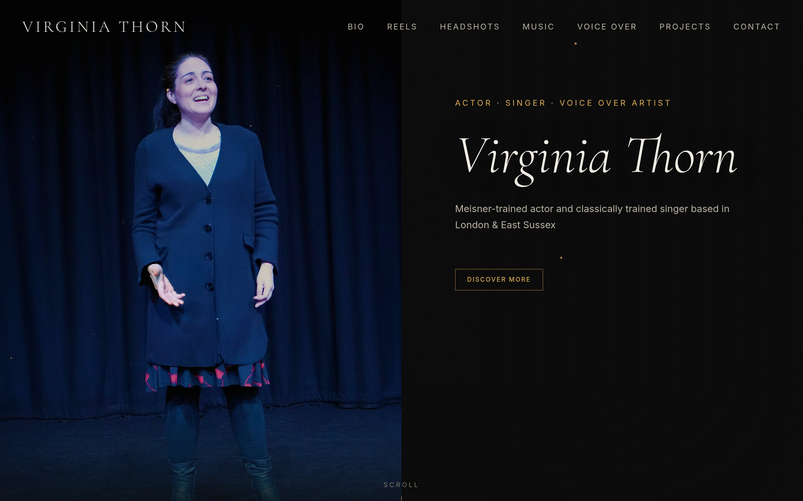
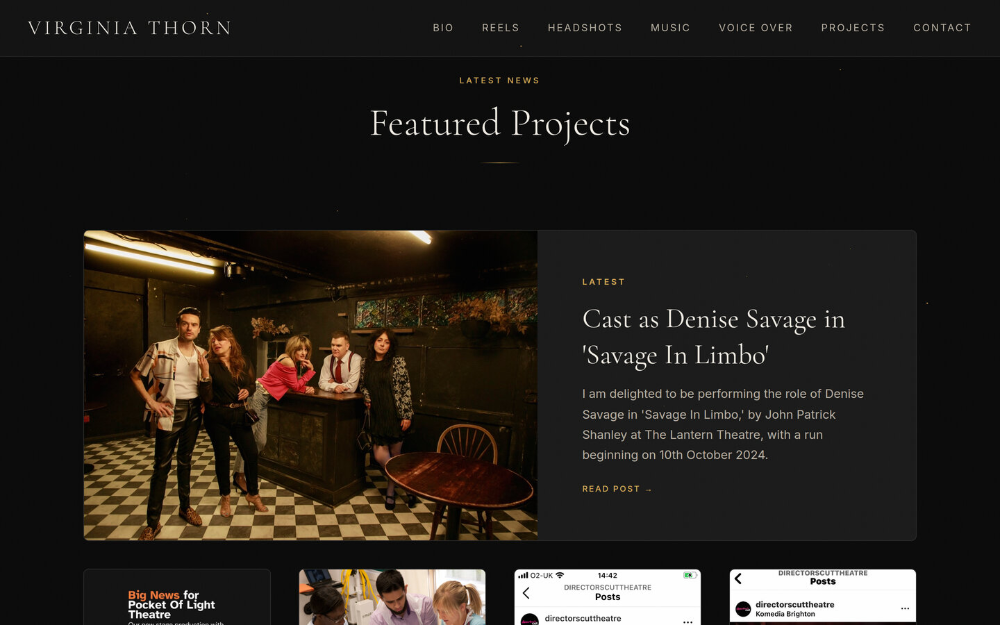
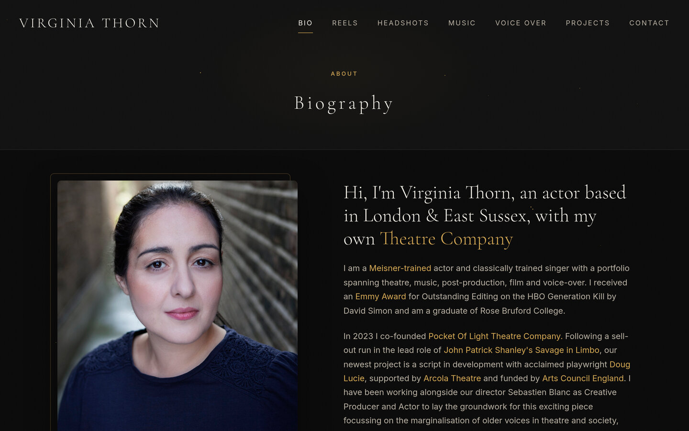
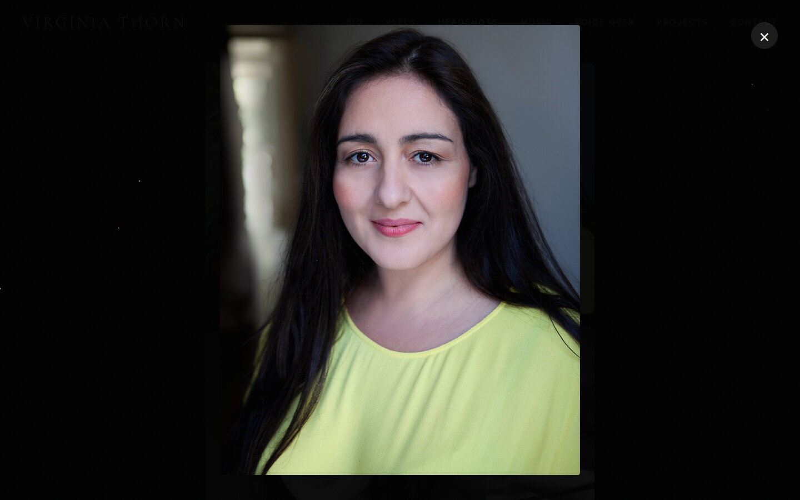
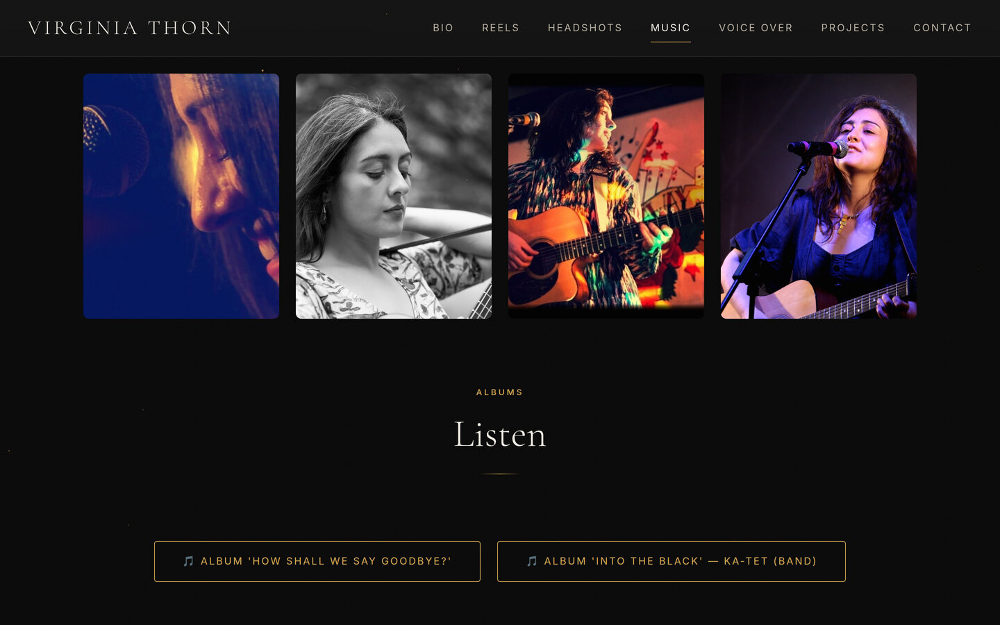
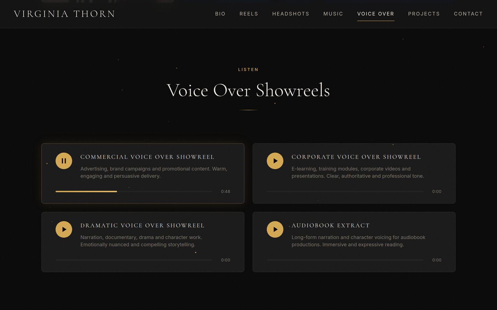
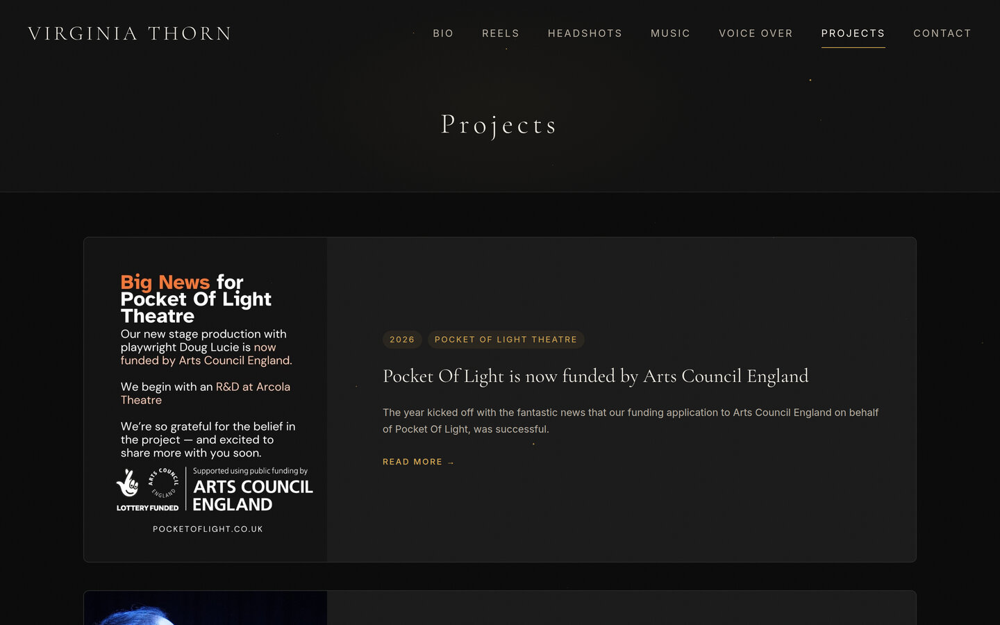
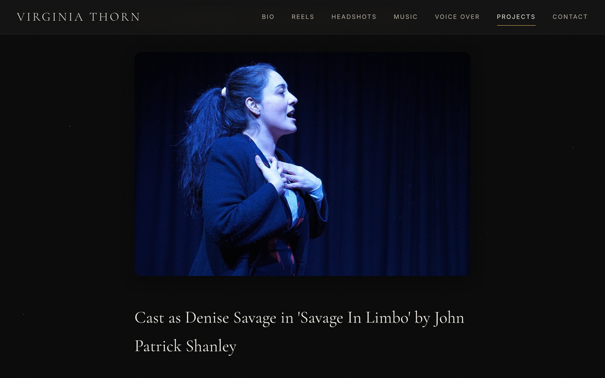
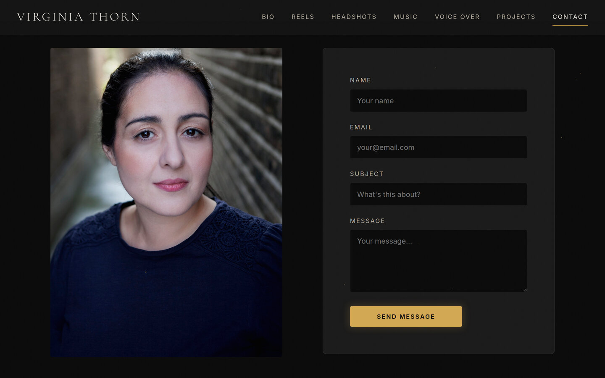
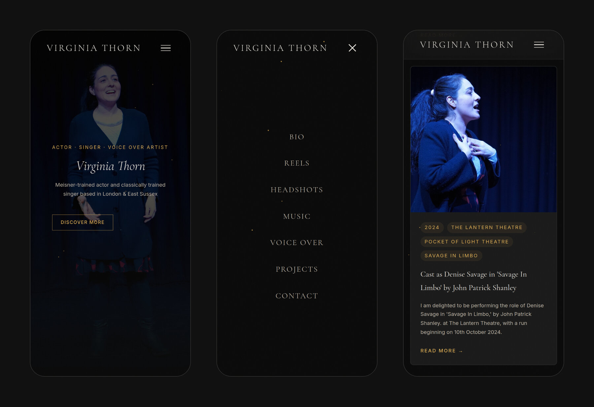

# Virginia Thorn Portfolio Website

A fast, static portfolio website built for **Virginia Thorn** — a Meisner-trained actor, classically trained singer, Emmy Award-winning sound editor, and voice-over artist based in London & East Sussex. 

The site is fully responsive, dependency-free (no complex bundlers or frameworks), and designed for quick loading with elegant, modern interactions.




## ✨ Features
* **Modern Aesthetic:** Clean, minimalist design with smooth scroll animations.
* **Fully Responsive:** Adapts seamlessly to all screen sizes and mobile devices.
* **Comprehensive Portfolio:** Includes dedicated pages for Bio, Reels, Headshots, Music, Voice Over, and Featured Projects.
* **Lightweight & Fast:** Built entirely with plain HTML, CSS, and Vanilla JavaScript. No heavy frontend frameworks or build steps required.
* **Self-Hosted Assets:** All fonts, images, and audio are hosted locally within the project to ensure structural independence.

## 📸 Screenshots

Desktop views at 1440 × 900, mobile views at 390 × 844. Click any image for the full-size version.

<table>
  <tr>
    <td width="50%" valign="top">
      
      <p align="center"><b>Featured Projects</b><br><sub>Homepage news cards</sub></p>
    </td>
    <td width="50%" valign="top">
      
      <p align="center"><b>Biography</b><br><sub>Portrait and bio with inline links</sub></p>
    </td>
  </tr>
  <tr>
    <td width="50%" valign="top">
      
      <p align="center"><b>Headshots</b><br><sub>Click-to-enlarge lightbox</sub></p>
    </td>
    <td width="50%" valign="top">
      
      <p align="center"><b>Music</b><br><sub>Performance photos and album links</sub></p>
    </td>
  </tr>
  <tr>
    <td width="50%" valign="top">
      
      <p align="center"><b>Voice Over</b><br><sub>Custom audio players, one mid-playback</sub></p>
    </td>
    <td width="50%" valign="top">
      
      <p align="center"><b>Projects</b><br><sub>Tagged project cards</sub></p>
    </td>
  </tr>
  <tr>
    <td width="50%" valign="top">
      
      <p align="center"><b>Project Page</b><br><sub>Savage In Limbo detail page</sub></p>
    </td>
    <td width="50%" valign="top">
      
      <p align="center"><b>Contact</b><br><sub>Portrait and contact form</sub></p>
    </td>
  </tr>
  <tr>
    <td colspan="2" valign="top">
      
      <p align="center"><b>Mobile</b><br><sub>Homepage, menu overlay and a project card at phone width</sub></p>
    </td>
  </tr>
</table>

## 🛠️ Tech Stack
* **Core:** HTML5, CSS3, Vanilla JS
* **Deployment:** Firebase Hosting (configured for fully static delivery)

## 📁 Project Structure

```text
public/
├── assets/
│   ├── audio/         # Local audio and voice-over assets
│   ├── fonts/         # Self-hosted fonts
│   └── images/        # High-res portraits, gallery images, and UI graphics
├── bio.html           # Biography & background
├── contact.html       # Contact details
├── headshots.html     # Photography gallery
├── index.html         # Homepage
├── music.html         # Music portfolio
├── projects.html      # Past and current acting/directing projects
├── reels.html         # Video showreels
├── script.js          # Interactions (Lightbox, Navigation, etc.)
├── styles.css         # Global styles
└── voiceover.html     # Voiceover samples
docs/
└── screenshots/       # README screenshots (not deployed)
firebase.json          # Firebase Hosting configuration
.firebaserc            # Firebase project alias
```

## 💻 Local Development

1. **Clone the repository:**
   ```bash
   git clone <your-repo-url>
   cd virginia-thorn-portfolio
   ```

2. **Serve Locally:**
   Since this is a fully static site, you can use any local web server. If you have the Firebase CLI installed:
   ```bash
   firebase serve
   ```
   *Alternatively, use extensions like `Live Server` in VS Code, Python's `http.server`, or Node's `http-server`.*

3. **Deploying (Firebase):**
   ```bash
   firebase deploy --only hosting
   ```

## 🔒 Notes & Guidelines

* **Platform Independence:** This repository has been prepared to run entirely independently from previous CMS providers.
* **Outbound Content:** The site intentionally uses embeds and external links (YouTube, Bandcamp, Spotlight, IMDb) for optimum performance and standard portfolio practices.
* **Security:** Keep private keys, `.env` files, Firebase debug logs, or AI tooling directories (like `.claude/`) out of version control.
* **Privacy:** The `public/assets` directory may contain personal information (such as CV screenshots). Always review personal content before public distribution.

## License and Usage

This repository is proprietary and is provided for viewing on GitHub only. It is not open source.

No license or permission is granted to copy, reproduce, modify, publish, distribute, sublicense, sell, reuse, or create derivative works from any part of this repository, including the source code, HTML, CSS, JavaScript, design, layout, text, images, graphics, audio, branding, and other assets, without prior written permission from the copyright holder(s).

See the [LICENSE](LICENSE) file for the full all-rights-reserved notice.

## 👨‍💻 Author and Development

Designed and built by **[Sagnik Bhattacharya](https://sagnikbhattacharya.com)**.

---
*© 2026 Virginia Thorn. All rights reserved.*
